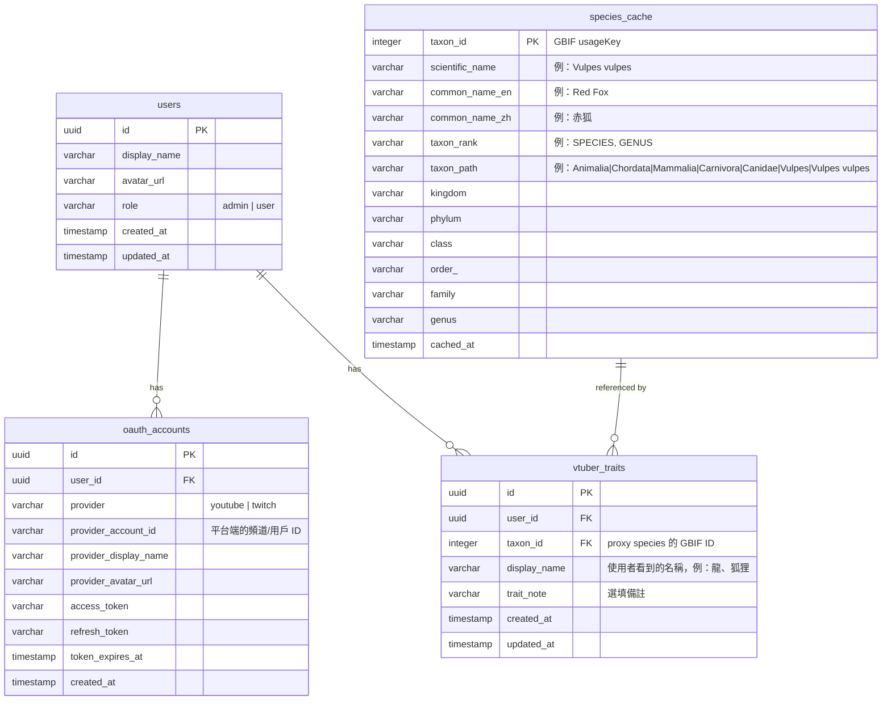

# Vtuber 生物分類系統 — 資料模型

## 架構決策摘要

| 決策項目 | 結論 |
|---------|------|
| 帳號識別 | OAuth 多平台連結，一個 user = 一個角色 |
| 生物分類資料 | GBIF 即時查詢 + 本地快取 |
| 幻想物種 | 做法 A：使用者自選現實 proxy species |
| 角色粒度 | 一個頻道 = 一個角色 |
| 技術棧 | React + Flask + PostgreSQL (Supabase/Neon) |
| 權限模型 | 頻道主編輯自己的資料 + 管理者全域權限 |

---

## ER Diagram



---

## 各表說明

### `users` — 角色（= 頻道主）

系統的核心實體。一筆 user 就代表一個 Vtuber 角色。

- `display_name`：角色名稱，首次登入時從 OAuth 平台帶入，之後可自行修改。
- `role`：區分一般使用者和管理者（你）。管理者可以替任何角色建檔和編輯。

### `oauth_accounts` — 平台帳號連結

一個 user 可以綁定多個平台帳號（一個 YouTube + 一個 Twitch）。

- 登入流程：用任一已綁定帳號的 OAuth 登入 → 查 `provider` + `provider_account_id` → 找到對應的 `user_id` → 登入完成。
- 首次登入自動建立 user + 第一筆 oauth_account。
- 之後可在設定頁綁定第二個平台。
- `provider_account_id` 加上 `provider` 做 unique constraint，防止同一個頻道被綁到多個 user。

### `species_cache` — 生物分類快取

從 GBIF API 拉回的分類資料存在這裡，避免重複查詢。

- `taxon_id`：直接使用 GBIF 的 `usageKey` 作為 PK，全球唯一。
- `taxon_path`：用 `|` 分隔的完整分類鏈（Materialized Path）。這是親緣距離計算的關鍵欄位——兩個物種的 path 從左邊開始比對，共同前綴越長代表越近。
- `kingdom` ~ `genus`：拆開存放方便篩選和顯示，但計算距離時以 `taxon_path` 為主。
- `cached_at`：記錄快取時間，必要時可設定過期重新拉取。

### `vtuber_traits` — 角色的物種特徵（多對多）

連結角色與物種。一個角色可以有多筆 trait（複合種）。

- `taxon_id`：指向 `species_cache`，這是實際用於計算的物種。對幻想物種來說，這裡存的是 proxy species。
- `display_name`：使用者看到的名稱。現實物種就是「狐狸」「貓」，幻想物種則是「龍」「鳳凰」等。這讓前端顯示和後端計算脫鉤。
- 複合種的處理：一個角色有多個物種特徵時，每個特徵各存一筆，不記錄比例。所有 trait 在親緣計算中等權處理。
- 不再區分 `trait_type`（生理/靈魂/服裝）——簡化模型。如果未來需要區分，加欄位即可。

---

## 約束與索引建議

```sql
-- oauth_accounts: 同一平台帳號只能綁一個 user
ALTER TABLE oauth_accounts
  ADD CONSTRAINT uq_provider_account UNIQUE (provider, provider_account_id);

-- vtuber_traits: 同一角色不應重複綁定同一物種
ALTER TABLE vtuber_traits
  ADD CONSTRAINT uq_user_taxon UNIQUE (user_id, taxon_id);

-- species_cache: taxon_path 的前綴查詢需要索引
CREATE INDEX idx_taxon_path ON species_cache (taxon_path varchar_pattern_ops);

-- vtuber_traits: 按 user 查詢
CREATE INDEX idx_traits_user ON vtuber_traits (user_id);

-- vtuber_traits: 按 taxon 查詢（找所有同物種角色）
CREATE INDEX idx_traits_taxon ON vtuber_traits (taxon_id);
```

---

## 親緣距離計算邏輯（概念）

兩個**單一物種**角色 A、B 的距離：

1. 取 A 和 B 的 `taxon_path`
2. 找最長共同前綴（Longest Common Prefix）
3. 距離 = 總階層數 - 共同階層數

例如：
- 赤狐 `Animalia|Chordata|Mammalia|Carnivora|Canidae|Vulpes|Vulpes vulpes`
- 家貓 `Animalia|Chordata|Mammalia|Carnivora|Felidae|Felis|Felis catus`
- 共同前綴到 `Carnivora`（4 層），赤狐有 7 層 → 距離 = 7 - 4 = 3

兩個**複合種**角色的距離：

A 有 n 個 trait，B 有 m 個 trait。對所有 trait 配對計算距離，取平均。

```
distance(A, B) = (1 / (n * m)) * Σ Σ taxon_distance(a, b)
```

此演算法為初始版本，未來可替換為 TimeTree 的演化分歧時間來獲得更精確的結果。
