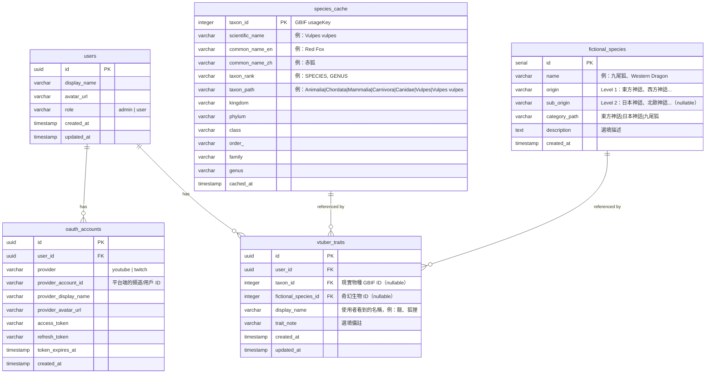

# Vtuber 生物分類系統 — 資料模型

## 架構決策摘要

| 決策項目 | 結論 |
|---------|------|
| 帳號識別 | OAuth 多平台連結，一個 user = 一個角色 |
| 生物分類資料 | GBIF 即時查詢 + 本地快取 |
| 幻想物種 | 獨立分類系統（來源→子體系→葉節點），與現實分類完全獨立 |
| 角色粒度 | 一個頻道 = 一個角色 |
| 技術棧 | React + Vite / Flask on Cloud Run / PostgreSQL (Supabase) / Supabase Auth |
| 權限模型 | 頻道主編輯自己的資料 + 管理者全域權限 |

---

## ER Diagram



---

## 各表說明

### `users` — 角色（= 頻道主）

系統的核心實體。一筆 user 就代表一個 Vtuber 角色。

- `display_name`：角色名稱，首次登入時從 OAuth 平台帶入，之後可自行修改。
- `role`：區分一般使用者和管理者（你）。管理者可以替任何角色建檔和編輯。

### `oauth_accounts` — 平台帳號連結

一個 user 可以綁定多個平台帳號（一個 YouTube + 一個 Twitch）。

- 登入流程：用任一已綁定帳號的 OAuth 登入 → 查 `provider` + `provider_account_id` → 找到對應的 `user_id` → 登入完成。
- 首次登入自動建立 user + 第一筆 oauth_account。
- 之後可在設定頁綁定第二個平台。
- `provider_account_id` 加上 `provider` 做 unique constraint，防止同一個頻道被綁到多個 user。

### `species_cache` — 生物分類快取

從 GBIF API 拉回的分類資料存在這裡，避免重複查詢。

- `taxon_id`：直接使用 GBIF 的 `usageKey` 作為 PK，全球唯一。
- `taxon_path`：用 `|` 分隔的完整分類鏈（Materialized Path）。這是親緣距離計算的關鍵欄位——兩個物種的 path 從左邊開始比對，共同前綴越長代表越近。
- `kingdom` ~ `genus`：拆開存放方便篩選和顯示，但計算距離時以 `taxon_path` 為主。
- `cached_at`：記錄快取時間，必要時可設定過期重新拉取。

### `fictional_species` — 奇幻生物分類

獨立於現實生物分類的奇幻生物分類表，以文化來源為主軸。

- 分類階層：來源（Level 1）→ 子體系（Level 2）→ 葉節點（具體生物）。
- `origin`：最上層分類，例如「東方神話」「西方神話」「克蘇魯神話」「奇幻文學」。
- `sub_origin`：第二層分類，例如「日本神話」「北歐神話」「希臘神話」。可為 NULL（如「克蘇魯神話」直接到葉節點）。
- `category_path`：用 `|` 分隔的完整分類鏈（Materialized Path），用於計算奇幻生物之間的親緣距離。
- 分類資料由管理者手動預建，暫不開放使用者申請新增。

### `vtuber_traits` — 角色的物種特徵（多對多）

連結角色與物種。一個角色可以有多筆 trait（複合種），可同時擁有現實物種和奇幻生物的 trait。

- `taxon_id`：指向 `species_cache`（nullable），代表現實物種。
- `fictional_species_id`：指向 `fictional_species`（nullable），代表奇幻生物。
- 兩者至少須填一個（CHECK constraint）。一筆 trait 通常只關聯其中一個。
- `display_name`：使用者看到的名稱。現實物種就是「狐狸」「貓」，幻想物種則是「龍」「鳳凰」等。
- 複合種的處理：一個角色有多個物種特徵時，每個特徵各存一筆，不記錄比例。所有 trait 在親緣計算中等權處理。

---

## 約束與索引建議

```sql
-- oauth_accounts: 同一平台帳號只能綁一個 user
ALTER TABLE oauth_accounts
  ADD CONSTRAINT uq_provider_account UNIQUE (provider, provider_account_id);

-- vtuber_traits: 同一角色不應重複綁定同一現實物種
CREATE UNIQUE INDEX uq_user_real_taxon
    ON vtuber_traits (user_id, taxon_id)
    WHERE taxon_id IS NOT NULL;

-- vtuber_traits: 同一角色不應重複綁定同一奇幻生物
CREATE UNIQUE INDEX uq_user_fictional
    ON vtuber_traits (user_id, fictional_species_id)
    WHERE fictional_species_id IS NOT NULL;

-- vtuber_traits: 至少填一個物種
ALTER TABLE vtuber_traits
    ADD CONSTRAINT chk_species_type
    CHECK (taxon_id IS NOT NULL OR fictional_species_id IS NOT NULL);

-- species_cache: taxon_path 的前綴查詢需要索引
CREATE INDEX idx_taxon_path ON species_cache (taxon_path varchar_pattern_ops);

-- fictional_species: category_path 的前綴查詢需要索引
CREATE INDEX idx_fictional_category_path
    ON fictional_species (category_path varchar_pattern_ops);

-- fictional_species: 按來源查詢
CREATE INDEX idx_fictional_origin ON fictional_species (origin);

-- vtuber_traits: 按 user 查詢
CREATE INDEX idx_traits_user ON vtuber_traits (user_id);

-- vtuber_traits: 按 taxon 查詢（找所有同物種角色）
CREATE INDEX idx_traits_taxon ON vtuber_traits (taxon_id);

-- vtuber_traits: 按 fictional_species 查詢
CREATE INDEX idx_traits_fictional ON vtuber_traits (fictional_species_id);
```

---

## 親緣距離計算邏輯（概念）

現實物種與奇幻生物的距離**分開計算、分開顯示**。

### 現實物種距離

每個現實物種 trait 各自獨立產生一組最近角色排行：

1. 取該 trait 的 `taxon_path`
2. 與資料庫中所有角色的現實 trait 做最長共同前綴（LCP）比較
3. 距離 = 總階層數 - 共同前綴層數

例如：
- 赤狐 `Animalia|Chordata|Mammalia|Carnivora|Canidae|Vulpes|Vulpes vulpes`
- 家貓 `Animalia|Chordata|Mammalia|Carnivora|Felidae|Felis|Felis catus`
- 共同前綴到 `Carnivora`（4 層），赤狐有 7 層 → 距離 = 7 - 4 = 3

### 奇幻生物距離

使用 `fictional_species.category_path` 做相同的 LCP 比較，每個奇幻 trait 各自獨立產生一組排行。

例如：
- 九尾狐 `東方神話|日本神話|九尾狐`
- 河童 `東方神話|日本神話|河童`
- 共同前綴到 `日本神話`（2 層），九尾狐有 3 層 → 距離 = 3 - 2 = 1

### 複合種

複合種角色的每個 trait 獨立查詢，產生多組結果，UI 並列顯示。

複合種範例：
角色有「海蛞蝓 + 麻雀」兩個 trait，系統對每個 trait 分別做查詢：
- 以「海蛞蝓」為基準 → 找出所有與 *Chromodoris* 最近的角色排行
- 以「麻雀」為基準 → 找出所有與 *Passer* 最近的角色排行

UI 同時並列顯示兩組結果。

若某 trait 類型在雙方之一不存在（例如一方只有現實物種而沒有奇幻生物），則該類不產生結果。

此演算法為初始版本，未來可替換為 TimeTree 的演化分歧時間來獲得更精確的結果。
